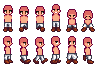

# Art

## Clothing

Clothing will include a chest piece, and must be designed from each walk direction (down, side and up).

### Sleeves

Sleeves will not be present on the main clothing chest piece. Rather, sleeves will be drawn on the characters arms themselves.
The sleeves should be drawn a specific color (TBD), so that the color can be programatically switched out depending on the clothing
piece that is worn.

## Pants

Pants will be designed with each possible leg position. By using slices within Aseprite, these leg positions can be specified in plain text:
* Walk_1 : This could indicate that a particular leg piece is used with animation Walk, on frame 1, and so on.

The image above is an example of how Stardew Valley does it. This is the first two walk animations created by ConcernedApe.
For each walking animation he has drawing a separate layer for pants. These have then been saved in a different file.
This is consistent with the rest of the animations and positions that the character can be in.